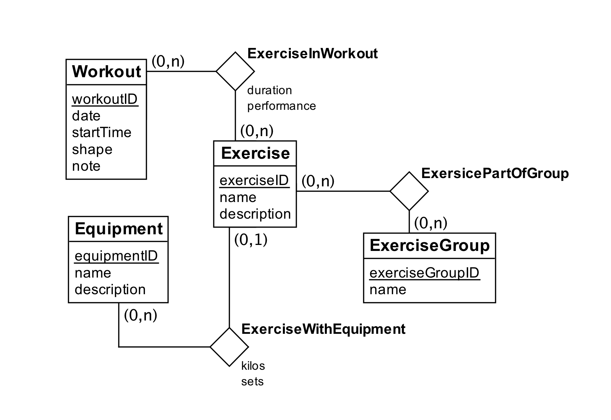

# Task a)

We made the following assumptions:

- We assume that an exercise can be related to multiple workouts.
- We change length to duration. Duration is set to an integrer, which is the number of minutes.
- We change the name of time to startTime.
- We assume that duration and performance belong to a relation between exercise and workout instead of workout.
- We assume that an exerciseWithEquipment can only use one equipment, and one only.

# Task b)
_The fields in **bold** are our primary keys_

Equipment(name, description, **id**)

Exercise(name, description, **id**)

Exercise_has_Equipment(**Exercise_id**, **Equipment_id**, kilos, sets)

- _Exercise_id is foreign key to Exercise, Equipment_id is foreign key to Equipment_

Exercise_has_ExerciseGroup(**Exercise_id**, **Equipment_id**)

- _Exercise_id is foreign key to Exercise, Equipment_id is foreign key to Equipment_

ExerciseGroup(name, **id**)

Workout(date, startTime, shape, note, **id**)

Workout_has_Exercise(**Workout_id**, **Exercise_id**, duration, performance)

- _Workout_id is foreign key to Workout, Exercise_id is foreign key to Exercise_

# Task c)
Our own use case: For every equipment retrieve exercises for a given time interval.  

1. The equipment-, workout-, and exercise-entities will be used to retrieve associated data.
2. Create a query that sorts workouts by date and startTime. From this, retrieve notes from the n first workouts.
3. Create a query that merges exerciseInWorkout and workout, and then filter out the results from the given time interval.  
4. ExerciseGroup and Exercise have a relation that can give us exercises in the same group.
5. Create a query that merges Equipment and Exercise to find exercises in which an equipment has been used, and then merges Workout and Exercise to compute the time.

# Task d)
The script is attached as `WorkoutDiary.txt`
